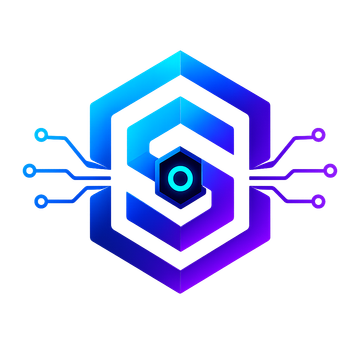
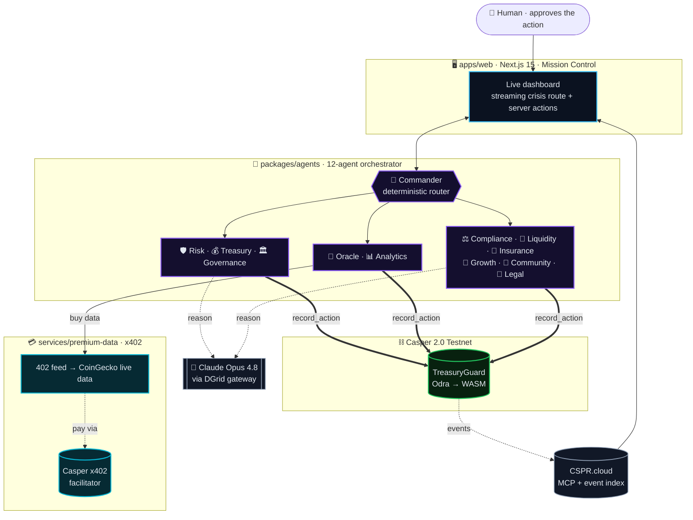

<div align="center">



# SentinelOS

### The Autonomous Operating System for Web3 Protocols

**Most Web3 AI _answers questions_. SentinelOS _runs the protocol_.**

A team of **12 AI agents** that detect an incident, pay for data over **x402**, decide a fix, and
**execute it on Casper** — while a human only approves. Every agent's action is a verifiable
on-chain transaction.

<br/>

[](https://sentinelos-x-web.vercel.app/)
[](https://youtu.be/kM4nOijX2M4)
[](https://casper.network)
[](https://dorahacks.io/hackathon/casper-agentic-buildathon)


**[▶ Try the live demo](https://sentinelos-x-web.vercel.app/)** &nbsp;·&nbsp; [▶ Watch the video](https://youtu.be/kM4nOijX2M4) &nbsp;·&nbsp; [On-chain proof](#-on-chain-proof--one-incident-12-transactions) &nbsp;·&nbsp; [Architecture](#-architecture) &nbsp;·&nbsp; [Run it yourself](#-run-it-yourself)

</div>

---

Built for the **Casper Agentic Buildathon 2026** (Agentic AI track) on **Casper Network 2.0**
(Rust → WASM via [Odra](https://odra.dev)). Not EVM, not Solana.

> **Live today:** a full **12-agent team** — each one anchors its own action to the on-chain
> `TreasuryGuard` contract during an incident · **x402** payments over the official Casper
> facilitator · a multi-page dashboard. **One incident → ~12 verifiable transactions** on
> [cspr.live](https://testnet.cspr.live).

---

## ⚡ See it live

### 👉 **[sentinelos-x-web.vercel.app](https://sentinelos-x-web.vercel.app/)**

Open **Mission Control**, hit **Trigger incident**, and watch the 12-agent network light up, the
reasoning stream in, and the on-chain records land — each linking to cspr.live. Runs on **live
Casper Testnet state**, no mock data. *(Or [run it locally](#️-run-it-yourself).)*

---

## 🎯 The autonomous crisis loop (real, end-to-end)

A **stress drill** — a simulated 7% USDC depeg on the **real, live-monitored** asset — handled
with zero human keystrokes, captured from a live run:

```text
🛡  Risk        → severity 82/100 (Claude): "severe deviation, collateral stress"
📡  Oracle      → buys the premium feed over x402 (real Casper facilitator + CSPR
                  settlement), confirms USDC peg + ETH reference — anchored on-chain
📊  Analytics   → real annualized vol → STRESSED regime, 24h depeg probability — anchored
🧭  Commander   → 82 > 60 threshold → wake the full team
💰  Treasury    → decides REBALANCE (88%, ~$4.2M protected) → executes on-chain
⚖️🌊🛟🌱📣📜  Compliance · Liquidity · Insurance · Growth · Community · Legal
                → six domain agents weigh in (Claude), each anchored on-chain
🏛  Governance  → drafts an emergency proposal, anchors it for the DAO
                → 12 agents · ~12 verifiable Casper transactions · one incident
```

> **Honesty:** the USDC price/volatility the agents read is **real and live** (CoinGecko); the
> depeg shock is a labeled drill; the reasoning, x402 settlement, and on-chain records are all
> real. We never present a simulated event as a real-world one.

---

## 🔗 On-chain proof — one incident, 12 transactions

From a single live run (`total_actions` went **8 → 20** on the contract), **every agent anchored
its own action** on Casper Testnet:

| # | Agent | Action | Transaction |
|--:|-------|--------|-------------|
| 1 | 📡 Oracle | `FEED_CONFIRMED` | [`1c6132d4…`](https://testnet.cspr.live/transaction/1c6132d49f804de4191e831a0d77985bd4e7c713bfa967e53e596239bbeaa00b) |
| 2 | 🛡 Risk | `ASSESS` | [`3baa239e…`](https://testnet.cspr.live/transaction/3baa239e7a9f385359a2d36f5a0fc5172915f4a6e9e9f12154116f9ced5e82a9) |
| 3 | 📊 Analytics | `ANOMALY` | [`ea0a0f81…`](https://testnet.cspr.live/transaction/ea0a0f81589d579e7698a3fcd50f80ecf4e9ddaefd0c74a02f938285ea4f3abe) |
| 4 | 🧭 Commander | `ROUTE` | [`d07af776…`](https://testnet.cspr.live/transaction/d07af776a50dd51d0f5df9b5ced3ed080099d68c2e306ac78f17758850d12484) |
| 5 | 💰 Treasury | `REBALANCE` | [`558753bf…`](https://testnet.cspr.live/transaction/558753bf1aa084563dad75bbd978db914be112a505fc21b70d116c67b4875161) |
| 6 | ⚖️ Compliance | `CAUTION` | [`0df8a44b…`](https://testnet.cspr.live/transaction/0df8a44bb50bf568e0d1abdbf684121ad60ed92e25e66285ba0537b6b029f7f1) |
| 7 | 🌊 Liquidity | `CAUTION` | [`2fbcd0d5…`](https://testnet.cspr.live/transaction/2fbcd0d5fcc99da7531cc9bb5aa4274c30dec30bc29efac13914a4b581d47152) |
| 8 | 🛟 Insurance | `CAUTION` | [`2058f352…`](https://testnet.cspr.live/transaction/2058f352c61a2bb7c95c7adb17e8fb7fa4b4fcceed57f941e09d7f24e899f263) |
| 9 | 🌱 Growth | `CAUTION` | [`9e7e0457…`](https://testnet.cspr.live/transaction/9e7e04574c44468289e922642a19cffa88b1beef013dc07b0db201221b8e47eb) |
| 10 | 📣 Community | `CAUTION` | [`b55d1c51…`](https://testnet.cspr.live/transaction/b55d1c51f2841803e3fbe64af5ec770a6d7d06766a70e38d6b2743223a17debf) |
| 11 | 📜 Legal | `CAUTION` | [`5bfa7239…`](https://testnet.cspr.live/transaction/5bfa7239968e649434ec8547b7f28474d1d289782dfb2bdae0bdffa2f70f57ef) |
| 12 | 🏛 Governance | `PROPOSAL` | [`996dff13…`](https://testnet.cspr.live/transaction/996dff137cfda9869a2c0eadfe7fa8f9c84971bf1fecd675f95a28069c2416e2) |

➕ **x402 settlement** paid over the official Casper facilitator: [`f82bbf7f…`](https://testnet.cspr.live/transaction/f82bbf7f76caff29b613ed21dca3ac76ab9ed63e928da9f66f73f9f196374c6d)
&nbsp;·&nbsp; **contract package:** [`7f56caa1…`](https://testnet.cspr.live/contract-package/7f56caa1d89d394786354bc382b1896fcd21fd77d0cea33c41a54e28c56990db)

---

## 🧠 Architecture



- **Contract** — `contracts/treasury_guard`, **Odra 2.8.2 → WASM**, deployed on Casper Testnet.
  Entry point `record_action(agent, action, severity, value)` updates on-chain storage and emits
  an `ActionRecorded` event; views `total_actions()` / `last_action_of(agent)`.
- **Agents** — `packages/agents`: a **12-agent orchestrator** on **Claude** (`@anthropic-ai/sdk`,
  tool-based structured output) via the **DGrid** gateway. Commander is a deterministic threshold
  gate; Oracle + Analytics are deterministic over live market data; the six advisory agents run
  in parallel on a fast model. Every agent anchors its own `record_action`.
- **x402** — `services/premium-data`: an HTTP **402 Payment Required** feed. On the challenge, the
  client calls the **official hosted Casper x402 facilitator** (`x402-facilitator.cspr.cloud`,
  authenticated with our CSPR.cloud key), confirms the `exact` scheme on `casper:casper-test`,
  then settles and unlocks **real live market data** (CoinGecko ETH volatility + USDC peg).
  Best-effort — the loop proceeds if it's down, so **qualification never depends on x402**.
- **Chain I/O** — `packages/casper`: `casper-js-sdk` 5.0.12 for `recordAction`, `readState`, and
  `transferCspr` (the signing key stays server-side).

---

## 🤖 The team — all 12 live, each anchors on Casper

| Agent | Role | On-chain |
|-------|------|----------|
| 🧭 **Commander** | Orchestrator — routes work on a deterministic threshold gate | 🟢 `ROUTE` |
| 📡 **Oracle** | Buys the premium feed over x402, confirms the live peg + reference price | 🟢 `FEED_CONFIRMED` |
| 🛡 **Risk** | Scores event severity 0–100 with a grounded rationale (Claude) | 🟢 `ASSESS` |
| 📊 **Analytics** | Real annualized volatility, regime, modeled depeg probability | 🟢 `ANOMALY` |
| ⚖️ **Compliance** | Reviews the action against policy + regulatory expectations (Claude) | 🟢 `CLEARED`/`FLAGGED` |
| 🌊 **Liquidity** | Slippage / market-depth check on the action (Claude) | 🟢 `CLEARED`/`CAUTION` |
| 💰 **Treasury** | Decides the protective action and executes it on-chain (Claude) | 🟢 `REBALANCE`… |
| 🛟 **Insurance** | Reserve / coverage-adequacy assessment (Claude) | 🟢 `CLEARED`/`CAUTION` |
| 🌱 **Growth** | TVL/retention impact + incentive response (Claude) | 🟢 `CLEARED`/`CAUTION` |
| 📣 **Community** | Sentiment + communications posture (Claude) | 🟢 `CLEARED`/`CAUTION` |
| 📜 **Legal** | Legal/entity exposure + disclosure flags (Claude) | 🟢 `CLEARED`/`FLAGGED` |
| 🏛 **Governance** | Drafts the emergency proposal and anchors it for the DAO (Claude) | 🟢 `PROPOSAL` |

> **Honest split:** Treasury + Governance take protocol **actions**; the other ten contribute real
> **data/analysis** (Oracle + Analytics deterministic over live data; the six advisory agents are
> real Claude reasoning). Every one anchors a verifiable `record_action`.

### Product modules

| Module | Status |
|--------|--------|
| **Mission Control** — live 12-agent network, streaming reasoning, threat + on-chain status | 🟢 Live |
| **Crisis Response** — streamed depeg → trace → x402 → tx → recover | 🟢 Live |
| **Agent Team** — the 12 live agents + a marketplace/SDK preview | 🟢 Live |
| **Governance Council** — AI council debates the response and submits a motion on-chain | 🟢 Live |
| **Security Center** — threat radar over on-chain state + live event log | 🟢 Live |
| Analytics · Marketplace checkout · Developer SDK · Settings | 🔵 Coming in v1 |

---

## 🚀 Roadmap — from a 12-agent team to an OS

Everything below extends something already live in this repo — not a wishlist.

**Next (v1)**
- **Agent Marketplace + Developer SDK** — publish an agent, install it like a VS Code
  extension; protocols run it, authors earn. *(Extends today's shared 12-agent runtime + on-chain anchor.)*
- **Multi-protocol coverage** — point SentinelOS at any protocol's treasury or positions;
  one control plane, many protocols. *(Extends the live `TreasuryGuard` contract.)*
- **Full on-chain governance** — token-weighted voting, timelocks, auto-execution of what
  passes. *(Today Governance drafts + anchors the proposal.)*
- **Configurable autonomy** — a policy dial that auto-executes under a risk threshold and
  human-gates above it. *(Today a human approves every action.)*

**The vision**
- **Provable AI operations** — a tamper-proof, on-chain record of *why* every autonomous
  action was taken. Only a Casper-native OS can promise this. *(Today all 12 agents anchor `record_action`.)*
- **An x402 data & compute economy** — agents autonomously buy data + compute over x402,
  full CEP-18 (WCSPR) + EIP-712 settlement. *(Today a real paid feed via the official Casper facilitator.)*
- **Agents that act, not just advise** — hedging, liquidity provisioning, insurance payouts
  via more contract entry points. *(Today Treasury executes a real REBALANCE.)*
- **A public MCP surface** — any external agent, or a human via Claude, drives SentinelOS
  through MCP. *(Today the official Casper MCP server is wired in.)*

---

## 🧩 Casper AI Toolkit — the sponsor stack we build on

SentinelOS runs on the official [Casper AI Toolkit](https://www.casper.network/ai):

- **Odra** — the `TreasuryGuard` contract (Rust → WASM), deployed to testnet.
- **CSPR.cloud** — real-time chain data: the Security Center's on-chain activity feed reads live
  `record_action` events via the CSPR.cloud REST API; it also authenticates the x402 facilitator.
- **MCP (Model Context Protocol)** — the official **Casper MCP server** (`mcp.testnet.cspr.cloud`)
  is wired in [`.mcp.json`](.mcp.json), so any MCP agent can query and operate TreasuryGuard —
  `get_account_deploys`, `get_contract`, `get_account_ft_balances`, and 40+ more. Verified: `CasperMcp v3.1.0`.
- **x402** — on every paid fetch the agent makes a **live, authenticated call to the official
  Casper x402 facilitator** (`x402-facilitator.cspr.cloud` `GET /supported`) to confirm the scheme
  + network and read its settlement `feePayer`. The value leg settles via a real native-CSPR
  transfer; `verifyPayment`/`settlePayment` wire the facilitator's `/verify` + `/settle` for the
  full CEP-18 (WCSPR) + EIP-712 production path.

```jsonc
// .mcp.json — the official Casper MCP server, keyed by CSPR_CLOUD_API_KEY
{ "mcpServers": { "casper": { "type": "http",
  "url": "https://mcp.testnet.cspr.cloud/mcp",
  "headers": { "X-CSPR-Cloud-Api-Key": "${CSPR_CLOUD_API_KEY}" } } } }
```

---

## 📦 Repository layout

```text
sentinelos-x/
├── contracts/treasury_guard/   Odra contract (Rust) — DEPLOYED to testnet
├── packages/casper/            TS chain layer (recordAction · readState · transferCspr)
├── packages/agents/            12-agent orchestrator + x402 client + facilitator
├── services/premium-data/      x402-gated live market feed (HTTP 402 · CoinGecko)
└── apps/web/                   Next.js dashboard (Mission Control · Crisis · Agents · Governance · Security)
```

---

## ▶️ Run it yourself

Requires **Node 20+** and a funded Casper Testnet key in `keys/secret_key.pem`, plus a `.env`.
LLM access is configured via `AGENT_BASE_URL` / `AGENT_MODEL` / `AGENT_AUTH_STYLE` + a key in
`ANTHROPIC_API_KEY` (works with native Anthropic or an Anthropic-compatible gateway like DGrid).

```bash
npm install

# 1. The dashboard (Mission Control · Crisis · Agents · Governance · Security)
npm run dev --workspace @sentinelos/web              # http://localhost:3000

# 2. The x402 premium-data feed (the paid data leg)
npm run start --workspace @sentinelos/premium-data   # :4021

# 3. The live 12-agent crisis loop — real Claude + x402 + on-chain records
X402_MODE=live npm run agent --workspace @sentinelos/agents
#   → prints all 12 cspr.live tx links. Add --dry (drop X402_MODE=live) for a no-spend check.
#   AGENTS_ONCHAIN=all writes all 12 (~240 CSPR); =core writes Treasury + Governance only.
```

Rebuild / redeploy the contract: `bash scripts/build_contract.sh`, then see `scripts/deploy.md`.
Deploy the dashboard: see [`DEPLOY.md`](DEPLOY.md).

---

## ✅ The honesty rules (non-negotiable)

1. **Never label mock data as real.** Live agents and on-chain txs are real; everything else is a
   clearly-marked "Coming in v1" card.
2. **Qualification never depends on x402.** The paid data fetch is best-effort; the loop proceeds
   if the feed or facilitator is down.
3. **Every "real" artifact links to cspr.live** — the agent trace, the x402 settlement, and each
   `record_action` shows a verifiable transaction hash.

---

<div align="center">

**SentinelOS** — AI agents. On-chain. Always on.

[▶ Live Demo](https://sentinelos-x-web.vercel.app/) &nbsp;·&nbsp; [▶ Video](https://youtu.be/kM4nOijX2M4) &nbsp;·&nbsp; [GitHub](https://github.com/zaxcoraider/sentinelos-x) &nbsp;·&nbsp; Casper Agentic Buildathon 2026

</div>
